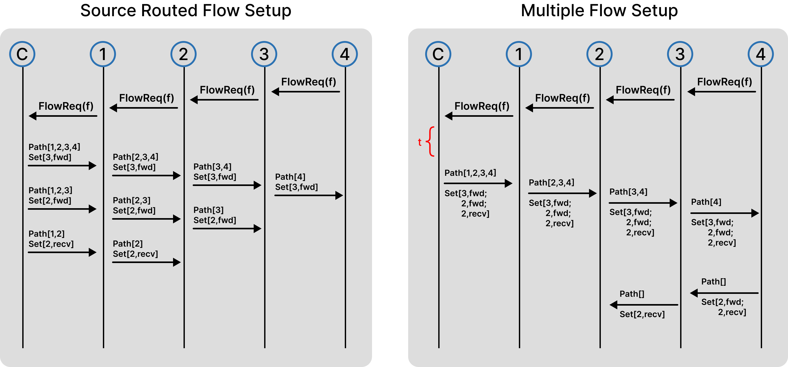

# IT-SDN-Improvements
[](https://github.com/contiki-ng/contiki-ng)
[](#)

This repository contains the implementation and source code for the project **"Performance Improvement in Software-Defined Wireless Sensor Networks"**. The project was developed as undergraduate research (Iniciação Científica) at the University of São Paulo (USP - EACH).

The main objective of this implementation is to apply packet processing manipulation techniques to the open-source IT-SDN architecture, aiming to overcome the energy and memory constraints inherent to Wireless Sensor Networks (WSNs).

## 🛠️ Technologies

* **[IT-SDN](https://ieeexplore.ieee.org/abstract/document/8805072)**: Base SDWSN architecture.
* **[Contiki-NG (v4.9)](https://www.contiki-ng.org/)**: Operating System for the Internet of Things.
* **[Cooja](https://docs.contiki-ng.org/en/develop/doc/tutorials/Running-a-RPL-network-in-Cooja.html)**: Sensor network simulator.

<details>
  <summary><strong>🔧 Installation & Setup</strong></summary>
  <br>
  
  **1. Clone Dependencies**
  - This project depends on Contiki-NG, which must be installed separately
  
  **2. Configure Contiki Path**
  - Applications are located in the ```applications/``` directory.
  - You must manually specify the path to your Contiki-NG installation in the Makefiles.
  - Edit the Makefile of your application and set: ```CONTIKI=/path/to/contiki-ng```
  
  **3. Configure IT-SDN Environment**
  - Before compiling, run the configuration script:
  ```bash
  cd applications
  chmod +x change_to_IM-SC_nullrdc-truebidir.sh
  ./change_to_IM-SC_nullrdc-truebidir.sh
  ```
  - This script automatically adjusts the ```project_conf.h``` and the Makefiles
  
  **4. Controller Setup (Qt-based)**
  - The IT-SDN controller is implemented using the Qt framework and runs outside Cooja.
  - So, to install the dependencies (Ubuntu):
  ```bash
  sudo apt install qttools5-dev qtcreator libqt5serialport5-dev qtbase5-private-dev
  ```
  
  - For other distributions, install equivalent Qt5 packages.
  
  **5. Configure Controller**
  - Edit the file: ```controller-server/controller-pc/controller-pc.pro.contiki```
  - Set the Contiki path: ```CONTIKI=/path/to/contiki-ng```
  
  **6. Build Controller**
  - Open Qt Creator and load the ```controller-pc.pro``` project  
  - Build the project using the default build option
  
  **7. Running with Cooja**
  - The controller runs externally (not inside Cooja)
  - Communication is done via serial interface
  - To run the Cooja simulation:
  ```bash
  cd contiki-ng/tools/cooja
  ./gradlew run
  ```
  **8. Script**
  > In the `/simulation` directory, there is a script called `run_simulations.sh` that automates the entire simulation process. It includes all necessary configurations to run multiple simulations in Cooja in headless mode (without a graphical interface), using log output.
  >
  > After configuring the desired parameters, simply run:
  > ```bash
  > ./run_simulations.sh
  > ```
</details>

## ✨ Features

### Packet Aggregation
This project introduces a packet processing mechanism at the queue level to mitigate congestion and packet loss caused by limited memory in wireless sensor nodes. When a new packet arrives, it is compared against packets already in the queue based on type, destination, route, and payload content.

Depending on the analysis, three actions may be taken:
- **Aggregation**: packets with the same destination and different payloads are merged into a single packet containing multiple subpackets.
- **Replacement**: redundant control packets (same content, source, and destination) overwrite older ones.
- **Insertion**: if no optimization is possible, the packet is appended to the queue.

Aggregated packets follow a structured format that preserves metadata (e.g., source address, sequence number, payload size) for each subpacket, ensuring correct processing at the destination, where they are de-aggregated and handled individually. The mechanism also respects protocol constraints such as the IEEE 802.15.4 packet size limit.


This approach reduces queue occupancy, lowers the number of transmissions, and significantly improves packet delivery under high traffic conditions.

> [!NOTE]
> **Core implementation files:**
> - it-sdn-contiki-ng/sdn-common/sdn-queue.c
> - it-sdn-contiki-ng/sdn-common/sdn-process-packets.c

### Multiple Flow Setup
This project introduces an optimization in the controller to reduce the overhead of flow configuration in SDWSNs. Instead of reacting to each flow request individually, the controller periodically analyzes the network state based on its flow tables.

During this process, the controller builds a graph representation of the network and identifies nodes that require flow updates. From this graph, it derives paths that group nodes needing configuration, considering their connectivity and relative position in the topology.

For each identified path, the controller generates a single **Multiple Data Flow Setup (MFS)** packet. This packet traverses the network and incrementally installs flow rules at each node along the path. As a result, multiple nodes are configured using a single control message.

This approach replaces the original behavior where one flow setup packet is sent per node, significantly reducing the number of control transmissions. Consequently, it lowers network overhead and energy consumption, while improving scalability in larger or more dynamic topologies.



> [!NOTE]
> **Core implementation files:**
> - it-sdn-contiki-ng/controller-server/sdn-graph.c
> - it-sdn-contiki-ng/controller-server/sdn-process-packets-controller.c
> - it-sdn-contiki-ng/controller-server/sdn-send-packet-controller.c
> - it-sdn-contiki-ng/sdn-common/sdn-process-packets.c

## 👥 Authors and Acknowledgments
- Author: Lion Chen.
- Advisor: Prof. Renan C. A. Alves.
- Institution: University of São Paulo (USP - EACH).

This work was supported by the São Paulo Research Foundation (FAPESP), Brazil.

